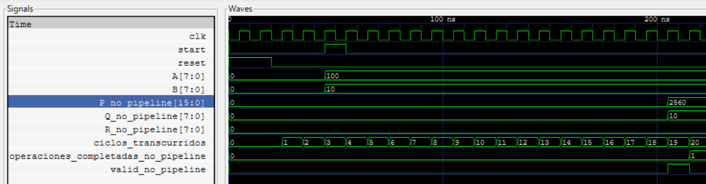
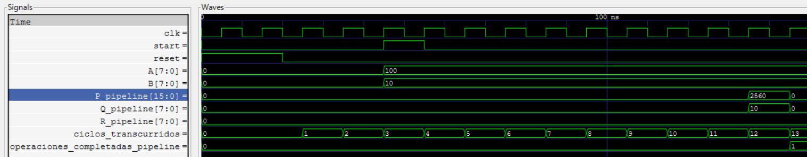

# Desglose Codigos

En esta seccion podras encontrar una descripcion de los codigos utilizados.

## Division sin pipeline

Este [código](division_no_pipe.v) contiene la ejecución de una división sin pipelines, la cual presenta diversas ventajas, como su facilidad de diseño, menor uso de área de hardware, menor consumo de potencia, y una verificación y *debugging* más sencillos debido a su simplicidad.

Sin embargo, también tiene grandes desventajas, como un *throughput* muy bajo, ausencia de paralelismo y, en la mayoría de los casos, una subutilización del hardware. De manera resumida, este código se compone de las siguientes etapas:

1. Puertos de entrada y salida: Son los encargados de la comunicación con el exterior del módulo, permitiendo recibir señales de control y datos, y enviar resultados hacia otros componentes del sistema.

2. Registros internos: Son los encargados de almacenar temporalmente los estados, valores intermedios y datos durante el procesamiento, actuando como la memoria interna del módulo.

3. Parámetro de configuración: Es el encargado de definir valores constantes que configuran el comportamiento del módulo, permitiendo ajustar características como los tiempos de procesamiento sin modificar la lógica principal.

4. Funcionamiento: Es la lógica encargada del proceso en sí mismo y, de manera general, se compone de:

    * Reset: Inicializa todos los registros a cero y limpia las señales de control.

    * Inicio de división: Captura los operandos A y B en registros internos, activa la bandera en_proceso, reinicia el contador y desactiva valid.

    * Procesamiento secuencial: Simula el tiempo de procesamiento incrementando un contador, y toma 16 ciclos de reloj para completar la operación.

    * Finalización: Calcula el cociente y el residuo usando operadores de Verilog, activa la señal valid por un ciclo y desactiva en_proceso para permitir nuevas operaciones.

**Aunque existe una flag para indicar el error de división por cero, aun así se ejecutará y podría generar resultados erróneos.**

## Division con Pipeline

Este [código](division_pipe.v) contiene el proceso de división usando pipelines. Para esto se propone un algoritmo denominado *Shift-and-Subtract*, que es una implementación digital de la división larga que procesa un bit por ciclo. Es análogo a cómo haces división manualmente, pero adaptado para hardware digital. En los siguientes enlaces encontrarás más información relacionada al tema:

1. [Division in verilog](https://projectf.io/posts/division-in-verilog/)

2. [Metodo binario de division](https://youtu.be/6ToR6vuRb3M?si=NgHEaSTlV-xpaKhN)

Este algoritmo nos brinda grandes ventajas como regularidad, predecibilidad, hardware simple y un pipeline natural. Esta última característica lo hace óptimo y esto se da porque:

1. Descomposición uniforme: 1 bit = 1 etapa = mismas operaciones

2. ependencias locales: Cada etapa solo necesita la etapa anterior

3. Tiempos balanceados: Todas las etapas tienen delay similar

4. Flujo continuo: Datos entran/salen cada ciclo una vez lleno

Sin embargo, este algoritmo no es recomendado cuando las operaciones son de baja complejidad, ya que se alcanza una eficiencia real solo con streams continuos de datos, haciendo que haya un rendimiento subóptimo. De manera general, el funcionamiento es así:

* Etapa cero: el pipeline recibe los valores iniciales cuando la señal start se activa. En este momento se cargan el dividendo A, el divisor B, el cociente parcial en cero y el residuo en cero. Si el divisor es cero, el módulo detecta la división inválida, genera un mensaje de error y llena el pipeline con valores especiales, evitando procesar una operación que no tiene sentido. Si la división es válida, esta etapa simplemente prepara los datos para que comiencen a avanzar por el pipeline.

* Etapa uno: el módulo realiza la primera operación del algoritmo de división binaria “shift-and-subtract”. Aquí se toma el bit más significativo del dividendo, se desplaza el residuo hacia la izquierda y se inserta ese bit. Luego se intenta restar el divisor; si el resultado no es negativo, el residuo se actualiza con esa resta y el primer bit del cociente parcial se establece en 1. Si la resta es negativa, el residuo se mantiene y el bit del cociente se pone en 0.

* Etapa dos: el proceso continúa con el siguiente bit del dividendo. Nuevamente se desplaza el residuo hacia la izquierda para hacer espacio, se añade el siguiente bit de A y se repite la comparación con el divisor. Con base en si la resta produce o no un valor negativo, se agrega un nuevo bit al cociente parcial. Cada etapa avanza exactamente un bit más en la formación del cociente.

* Etapa tres a siete: se repite el mismo patrón para los bits restantes del dividendo. Cada etapa toma los valores parciales producidos por la etapa anterior, ejecuta un desplazamiento del residuo, inserta el siguiente bit de A y determina si el divisor cabe o no en el nuevo residuo. De esta manera, el cociente se va construyendo progresivamente desde el bit más significativo hasta el menos significativo. Al tratarse de un pipeline, mientras una operación avanza a una nueva etapa, otra diferente puede estar entrando al módulo, permitiendo procesar múltiples divisiones solapadas en ciclos sucesivos.

* Etapa ocho: los valores llegan al final del pipeline, donde se genera la salida definitiva. El cociente ya está completamente formado y el residuo contiene el valor final después de todas las restas. Estos dos valores se combinan en la salida P, donde la parte alta contiene el cociente y la parte baja el residuo. Además, la señal valid se activa para indicar que la operación ya terminó y que la salida es correcta y puede ser usada por otros módulos del sistema.

