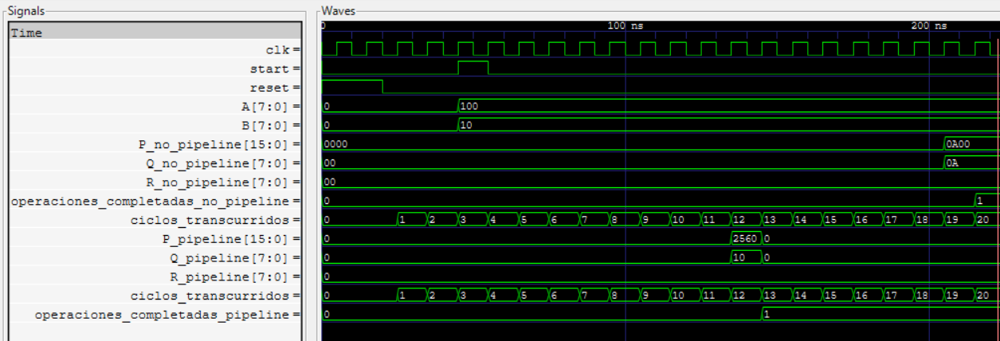
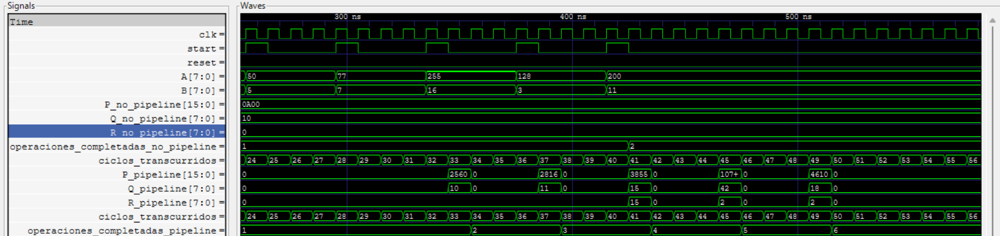
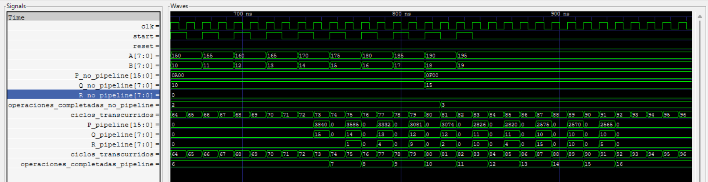

# Explicacion del testbench

Este testbench está diseñado para comparar exhaustivamente el rendimiento y funcionalidad de dos implementaciones de divisores: uno sin pipeline y otro con pipeline. Su objetivo principal es demostrar las ventajas/desventajas de cada arquitectura bajo diferentes condiciones de operación y para el cual se plantearon los siguientes objetivos: 

1. Validar funcionalidad: Ambos divisores producen resultados correctos

2. Medir latencia: Cuántos ciclos toma cada operación individual

3. Calcular throughput: Operaciones por ciclo en escenarios reales

4. Comparar rendimiento: Mejora del pipeline sobre no-pipeline

5. Verificar robustez: Comportamiento con casos especiales y errores

De manera general el codigo se compone de las siguientes etapas:

1.  Inicialización del entorno: El testbench comienza declarando todas las señales que conectarán con los dos módulos: reloj, reset, start, A, B y las señales de salida de ambos divisores. También crea contadores para registrar cuántas operaciones terminan cada módulo y cuántos ciclos pasan.Además, se instancian los dos divisores para poder simularlos en paralelo.

2. 2Generación del reloj y conteo de ciclos: Hay un bloque always que alterna la señal clk para simular un reloj real. tro bloque incrementa el contador ciclos_transcurridos en cada flanco de subida, salvo cuando está en reset. sto permite medir cuántos ciclos tarda cada módulo en producir resultados y comparar su eficiencia.

3. Monitoreo de resultados: Cada ciclo, el testbench revisa si alguna unidad terminó una división (cuando su señal valid se activa).Si termina, el testbench:

    * Incrementa el número de operaciones completadas.
    * Muestra por pantalla el cociente y residuo producidos.
    * Detecta división por cero.
    * Compara los resultados del pipeline y del no-pipeline si ambos llegaron el mismo ciclo.
    * Si los resultados difieren, incrementa errores_comparacion.
    
    Este bloque es vital porque valida que ambos módulos produzcan exactamente el mismo resultado.

4. Tarea para enviar operandos: La tarea enviar_operandos(a, b) encapsula el proceso de enviar A, B y activar start durante un ciclo. ambién imprime qué operación se está enviando y cuál debería ser el resultado esperado.Esta tarea hace el testbench mucho más limpio y fácil de leer.

5. Secuencia de pruebas: El initial contiene todas las pruebas que se ejecutarán automáticamente:

    * Prueba 1 – Una sola división: Se envía una división simple para asegurarse de que ambos módulos funcionan con un caso básico.

    * Prueba 2 – Varias divisiones con espacio: Se envían varias operaciones separadas por unos ciclos.Esto permite comparar comportamiento sin saturar el pipeline.

    * Prueba 3 – Máxima velocidad (una por ciclo): Se envían 10 operaciones seguidas sin esperar.Aquí se aprecia el beneficio del pipeline,el no-pipeline demora varias decenas de ciclos por operación,mientras que el pipeline entrega resultados cada ciclo después de llenarse.

    * Prueba 4 – Casos especiales : Pruebas importantes como:

        * división por cero
        * dividendo menor que divisor
        * dividendo igual a cero
        * división exacta
        * divisor igual a 1

    Esto ayuda a validar robustez y comportamiento del hardware.

6. Resultados finales: Cuando terminan todas las pruebas, el testbench imprime:

    * ciclos totales
    * operaciones completadas por cada divisor
    * si hubo errores de comparación
    * mejora del rendimiento del pipeline (factor de aceleración)
    * throughput de ambos módulos (operaciones por ciclo)

Finalmente termina la simulación con $finish.

Los resultados obtenidos se observan aca:

En esta primera prueba es posible verificar el retardo inicial asociado al uso de pipelines; asimismo, se observa que la operación se completa mucho más rápido cuando se utilizan pipelines.

En esta segunda prueba, como se había mencionado, se envían varias operaciones pero sin llegar a saturar, y ya se comienza a notar la importancia de esta implementación: se completaron dos operaciones, mientras que sin pipelines solo se completó una. Además, las entradas proporcionadas durante ese tiempo no serán ejecutadas, por lo que no se obtendrá el resultado jamás.

En esta última prueba se enviaron rápidamente entradas para realizar la operación y se corrobora, una vez más, que sin pipelines esas operaciones no se ejecutan, mientras que con pipelines se realizaron correctamente.